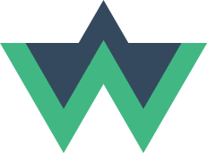

<p align="center">
  <br>
  
  <br>
  <br>
</p>

# THIS REPO IS NOT CURRENLY BEING MAINTAINED, USE AT YOUR OWN RISK
# Vuex-Watcher
](https://img.shields.io/badge/Release-0.1.3-%233fbced.svg)
[](https://opensource.org/licenses/MIT)

> Vue-Watcher was created to empower Vue.js developers to easily utilize Vuex subscribers similalr to vue's data prop watcher 

_This is compatible with Vue 2.*_

> This is an Alpha build, use at your own risk

## Table of Contents

-  [Install](#install)

-  [Usage](#usage)

-  [Build Setup](#build)


## NPM Install

``` bash
npm install vuex-watcher
```

### Local Clone

``` bash
$ git clone https://github.com/AndrewR3K/vuex-watcher.git vuex-watcher

$ cd vuex-watcher
$ npm install
```

### Development

```bash
$ npm install

$ npm run dev
```

## Usage
_An in-depth example application can be found within /example folder of this repo._

### General Usage
```javascript
import VueWatcher from 'vuex-watcher';
const myVueWatcher = new VueWatcher({
  environment: 'development',
  watches: [
    {
      getter: 'getactive',
      cb: (val) => console.log(`Running getters' "getMsg" callback => ${val}`)
    }
  ]
})

export default new Vuex.Store({
  plugins: [myVueWatcher]
})
```

### Environment
It is recommended to set the environment to "production" when running in a production state.

Options: 'development', 'production'

```javascript
{
  environment: <environment>
}
```

### Watcher Types

#### State
```javascript
{
  watches: [
    {
      state: 'text',
      cb: (val) => console.log(`Running state "text" callback => ${val}`)
    }
  ]
}
```

#### Getters
```javascript
{
  watches: [
    {
      getter: 'getactive',
      cb: (val) => console.log(`Running getters "getMsg" callback => ${val}`)
    }
  ]
}
```
